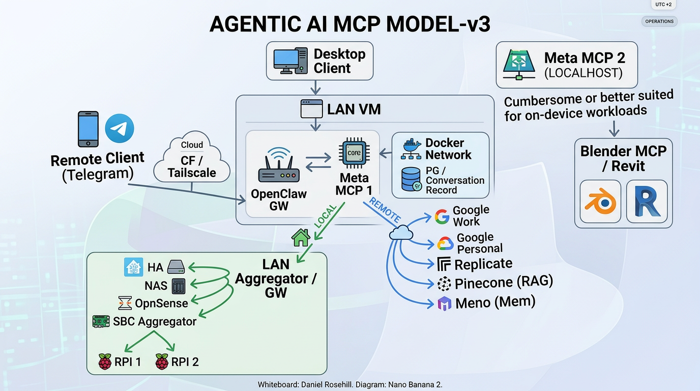
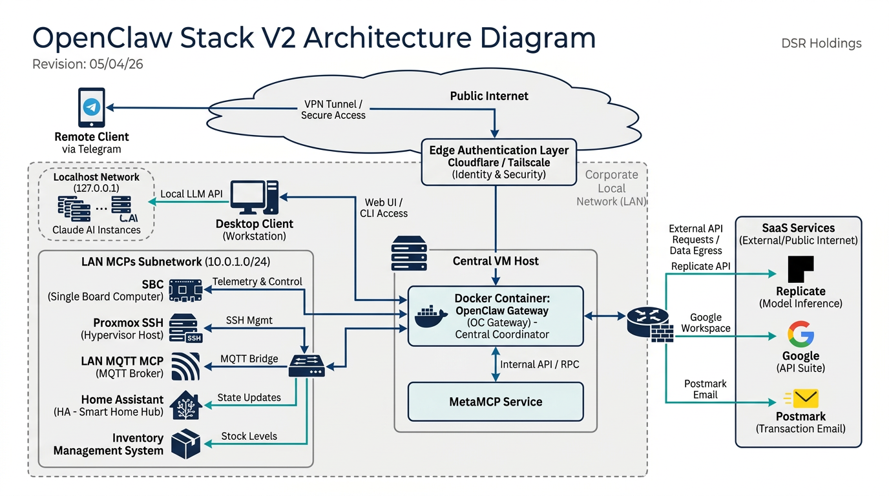

# Open Claw Stack





This repository version controls documentation for a unified deployment stack bundling [OpenClaw](https://github.com/openclaw/openclaw) and [MetaMCP](https://github.com/metatool-ai/metamcp).

## Latest Iteration: Agentic AI MCP Model v3

The v3 model expands the stack into a multi-layered, multi-gateway topology designed to validate MCP discovery and tool routing across nested aggregation points.

### Clients

- **Desktop Client** — connects directly to the LAN VM when on-network.
- **Remote Client (Telegram)** — reaches the stack from outside the LAN via a Cloudflare Tunnel + Tailscale path.

### LAN VM (primary host)

The LAN VM hosts the core of the stack:

- **OpenClaw GW** — the user-facing gateway / chat surface.
- **Meta MCP 1** — the primary MCP aggregator that OpenClaw talks to. It fans out to both **local** (LAN) and **remote** (cloud) MCP backends.
- **Docker Network** — internal Docker bridge containing supporting services, including a **Postgres** instance used for conversation records.

### LAN Aggregator / GW (experimental)

A second-tier aggregator running on the LAN, reached locally from Meta MCP 1. It groups together purely on-LAN MCP sources:

- **Home Assistant**
- **NAS**
- **OpnSense**
- **SBC Aggregator** (experimental) — a further nested aggregator that itself fronts small single-board computers (**RPI 1**, **RPI 2**) exposing their own MCP endpoints.

Both the **LAN Aggregator GW** and the **SBC Aggregator** are experimental. The point of this layout is to validate that MCP tool discovery, naming, and invocation still work cleanly when traffic traverses **multiple gateway layers** (OpenClaw → Meta MCP 1 → LAN Aggregator → SBC Aggregator → device).

### Remote / Cloud MCP services

Meta MCP 1 also routes outbound to cloud MCP services over a Cloudflare path:

- **Google (Work)** and **Google (Personal)**
- **Replicate**
- **Pinecone** (RAG)
- **Meno** (memory)

### Meta MCP 2 (localhost)

A second MetaMCP instance pinned to **localhost** on the desktop, intended for tools that are cumbersome to run inside the VM or are better suited to on-device workloads — currently fronting **Blender MCP** and **Revit**.

### Design intent

- Keep private/LAN-only services strictly on the LAN side, behind nested aggregators.
- Keep cloud services proxied through a single hardened egress path.
- Keep host-bound creative tooling (Blender / Revit) on a separate localhost MetaMCP rather than pushing it through the VM.
- Use the experimental nested-aggregator branch to stress-test multi-hop MCP discovery before promoting it out of experimental status.

## Components

| Component | Purpose | Port |
|-----------|---------|------|
| **OpenClaw** | Personal AI assistant (gateway + CLI) | 18789 (gateway), 18790 (bridge) |
| **MetaMCP** | MCP aggregator/orchestrator/gateway | 12008 |
| **PostgreSQL** | Database backend for MetaMCP | 5432 |
| **Watchtower** | Automatic container image updates | — |
| **Cloudflare Tunnel** | Secure external access without port forwarding | — |

## Architecture

```
                  ┌───────────────────────────────────┐
                  │        Desktop / Mobile            │
                  │                                    │
                  │   OpenClaw client  or  Browser     │
                  │   (app / CLI)        (Chat UI)     │
                  └──────────┬────────────┬────────────┘
                             │            │
              ┌──────────────┘            └──────────────┐
              │ On LAN                       Remote       │
              │                                           │
    ┌─────────▼──────────┐            ┌───────────────────▼──┐
    │  Direct connection  │            │   Cloudflare Tunnel   │
    │  (LAN IP / anti-   │            │   (secure ingress)    │
    │   hairpin rule)    │            └───────────┬───────────┘
    └─────────┬──────────┘                        │
              │                                   │
              └──────────────┬────────────────────┘
                             │
┌────────────────────────────┼───────────────────────────────────────┐
│  Home Server / VM          │                                       │
│  (Docker Compose)          │                                       │
│                  ┌─────────▼──────────┐                            │
│                  │     OpenClaw        │                            │
│                  │     Gateway         │                            │
│                  │   :18789 / :18790   │                            │
│                  └───┬─────────────┬───┘                            │
│                      │             │                                │
│       MCP Connection 1    MCP Connection 2                          │
│       (local / LAN)       (cloud, via CF)                           │
│                      │             │                                │
│            ┌─────────▼───┐   ┌─────▼──────────────────┐            │
│            │  MetaMCP    │   │  MetaMCP (on VPS)       │            │
│            │  (local)    │   │  SSE endpoints secured  │            │
│            │  :12008     │   │  behind Cloudflare      │            │
│            └──────┬──────┘   └─────┬──────────────────┘            │
│                   │                │                                │
│         ┌─────────┼────────┐       │                                │
│         │         │        │       │                                │
│   ┌─────▼──┐ ┌───▼───┐ ┌──▼──┐   │                                │
│   │ MCP    │ │ MCP   │ │ MCP │   │                                │
│   │ Server │ │ Server│ │ Srvr│   │                                │
│   │ (LAN)  │ │ (LAN) │ │(LAN)│   │                                │
│   └────────┘ └───────┘ └─────┘   │                                │
│                                   │                                │
│                      ┌────────────┼────────────┐                   │
│                      │            │            │                   │
│                  ┌───▼───┐  ┌─────▼──┐  ┌─────▼──┐                │
│                  │ Cloud │  │ Cloud  │  │ Cloud  │                │
│                  │ MCP   │  │ MCP    │  │ MCP    │                │
│                  │ Svc 1 │  │ Svc 2  │  │ Svc 3  │                │
│                  └───────┘  └────────┘  └────────┘                │
│                                                                    │
│       ┌────────────┐  ┌──────────┐                                 │
│       │ Watchtower │  │ Postgres │                                 │
│       │ (updates)  │  │ (MetaMCP)│                                 │
│       └────────────┘  └──────────┘                                 │
└────────────────────────────────────────────────────────────────────┘
```

### Usage Patterns

**Client access — on LAN:** The desktop connects directly to the VM's LAN IP (using an anti-hairpin rule or a LAN-specific DNS endpoint). No tunnel overhead.

**Client access — remote:** From outside the home network, traffic reaches the server via the Cloudflare Tunnel.

**MCP topology — two MetaMCP connections:**

1. **MetaMCP (local)** — runs on the same server, aggregates MCP servers on the LAN (home automation, local databases, file systems, etc.). OpenClaw connects to it locally within Docker networking.
2. **MetaMCP (on VPS)** — a separate MetaMCP instance on a remote VPS, exposing cloud MCP services via SSE endpoints secured behind Cloudflare. OpenClaw connects to it as a remote MCP endpoint.

This split keeps local/private MCP services on the LAN while cloud services are proxied through a hardened remote gateway.

---

Both projects use **Docker Compose** as their official deployment method. This stack combines them into a single `docker-compose.yml` so they can be deployed together on an Ubuntu server.

- **OpenClaw** runs as a gateway service exposing a web UI and bridge for channel integrations
- **MetaMCP** provides a unified MCP endpoint, aggregating multiple MCP servers behind a single proxy with a management UI
- **PostgreSQL** is required by MetaMCP for configuration and state storage

OpenClaw can be configured to use MetaMCP as its MCP endpoint, giving the assistant access to all MCP servers managed through the MetaMCP dashboard.

**Watchtower** monitors all running containers and automatically pulls updated images, keeping the stack current without manual intervention.

**Cloudflare Tunnel** (`cloudflared`) provides secure ingress to the services without opening ports on the server. Configure ingress rules in the Cloudflare Zero Trust dashboard to route your domain(s) to the OpenClaw and MetaMCP services.

## Deployment

Both components follow their upstream Docker deployment methods:

- **OpenClaw**: uses the official `openclaw` Docker image with volume mounts for config and workspace
- **MetaMCP**: uses the official `ghcr.io/metatool-ai/metamcp` image with a PostgreSQL dependency

### Setup

1. Clone this repo and create your `.env`:
   ```bash
   cp example.env .env
   ```
2. Set `CLOUDFLARE_TUNNEL_TOKEN` (create a tunnel in [Cloudflare Zero Trust](https://one.dash.cloudflare.com/) > Networks > Tunnels)
3. Configure tunnel ingress rules to point your domains at `openclaw-gateway:18789` and `metamcp:12008`
4. Deploy:
   ```bash
   docker compose up -d
   ```

See the `docker-compose.yml` for the combined stack configuration.

## References

- [OpenClaw Docker docs](https://docs.openclaw.ai/install/docker)
- [MetaMCP Docker docs](https://docs.metamcp.com)
- [OpenClaw GitHub](https://github.com/openclaw/openclaw)
- [MetaMCP GitHub](https://github.com/metatool-ai/metamcp)
